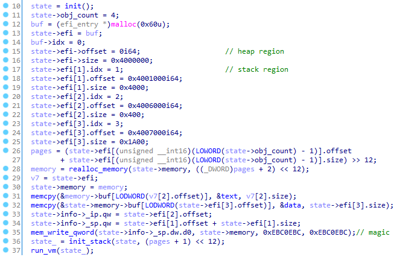
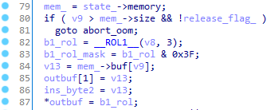
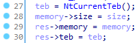
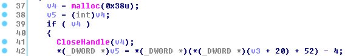
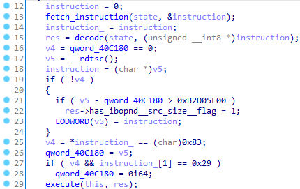
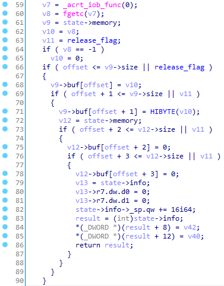
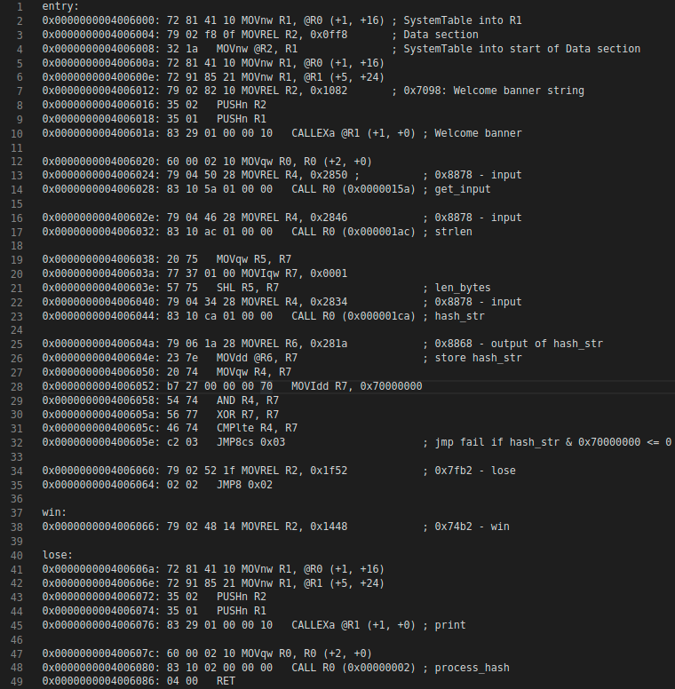
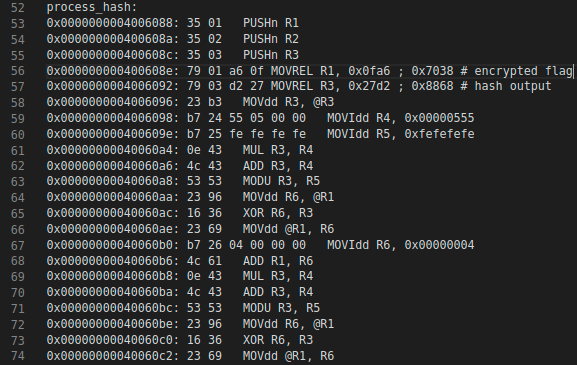

# stf20-writeups

## Reversing - Time Travel
We are given a TIMELOG.run file. This is a windows Time Travel Debugging trace, which we can open and analyse with windbg preview. By running the `lm m *` command within the trace to list the loaded modules, we can see that this is a trace of (64-bit) wordpad.exe, suggesting that we likely need to leak the typed contents.

wordpad.exe is a Windows GUI application, which means that at some level, user input should be dispatched to the application in an event loop and received by a variant of the `USER32!GetMessage` function, in our case the `USER32!GetMessageW` function. Indeed, putting a breakpoint on the method shows it getting triggered. `GetMessageW` reads the events into the `LPMSG` pointer in its first argument, which has the following structure:

```
typedef struct tagMSG {
  HWND   hwnd;
  UINT   message;
  WPARAM wParam;
  LPARAM lParam;
  DWORD  time;
  POINT  pt;
  DWORD  lPrivate;
} MSG, *PMSG, *NPMSG, *LPMSG;
```

We are interested in messages of type `WM_CHAR` (0x102), which are dispatched to the event queue after `TranslateMessage` translates virtual-key messages into characters. `wParam` contains the character code for the key and `lParam` contains the repeat count (from holding down the key) in a bitfield. Fortunately there were no repeats and we only needed to look at the `wParam` field.

Therefore we set a breakpoint near the end of `GetMessageW`, and using the pointer to the buffer saved in `rbx` read out the message type and print the character if it is an `WM_CHAR` message:

```
bp USER32!GetMessageW+0x54 ".if (poi(rbx+0x8)==0x102) {.printf \"%c\n\", poi(rbx+0x10)} .else {gc}"
```

and then repeatedly executing `g` and waiting for the breakpoint to hit eventually prints out the contents of the file character by character (including backspaces, which have to be accounted for), giving the flag `govtech-csg{Y0u_d0NT_n3eD_no_71m3$T0nE}`.


## Reversing - Striking Back 1
We are given a .NET binary that we can decompile. Some reversing indicates that it wants a 32-character string in the first argument to the executable, then it does a bunch of repeated hashing of the input before checking some bytes in the hashed result. This turns out to mostly be time-wasting and we can ignore this, as it does not use this result further.

After that, it takes the input and runs it through `func1`, `func4` and `func2` in that order twice, then does a character-by-character check on the output with a string stored in the binary, and prints out our input as the flag. These functions are not particularly interesting and just scramble the input, the only one of note is `func4`, which is implemented as a native method, which we can reverse using IDA.

All of the functions are easily invertible, and by executing their inverses in the reverse order on the string stored in the binary we can obtain the flag `govtech-csg{h0pp1ng_btwn_w0rlds}`. See the [solve script](striking-back-1-solve.py) for details.


## Reversing - Striking Back 2
We are given a x86 binary to reverse. Running it indicates that it seems to want some kind of password. Reversing the binary, we find that this is some sort of VM running its own bytecode. It has a fairly complicated variable length instruction encoding/decoding and weird memory addressing modes which complicates things. As it turns out, it happens to be a slightly modified version of a userspace UEFI bytecode VM ([here, chapter 22](https://uefi.org/sites/default/files/resources/UEFI%20Spec%202.8B%20May%202020.pdf)) found [here](https://github.com/yabits/ebcvm) with several small differences:

1. During VM setup, instead of parsing out the code/data to be executed from a UEFI blob provided on the command line, it loads the UEFI text and data sections directly from blobs stored in the binary itself (poorly chosen names are mine, a lot of reversing was done before I figured out that it was actually cloned from a repo):  


2. In the instruction fetch routine, before the leading bytes of the function are processed to determine the instruction length, the first byte is rotated left by 3 (the `ROL` line in the following image):  


3. In the initialization of the vm structure, there is an additional field used to store the TEB:  
  
In the instruction decode routine, there is a little bit of anti-debug inserted, which a) calls `CloseHandle` on a malloced buffer, which raises an exception if the program is being debugged, which is caught by an exception handler and terminates the program, and b) reads out the value of the `LastError` field in the TEB after the CloseHandle errors out and uses that as an opaque constant to initialize the `size` field of the decoded instruction struct (sorry, don't have my names for this one as I patched it out on my binary and unpatching it breaks the decompilation):  


4. In the main VM loop, between instruction decode and instruction execute, there is a timestamp check to make sure that not too long has passed and some other stuff (I did not think about this too hard):  


5. In instruction execution, when handling excalls (calls to native methods like, in this case, reading input from stdin), the code in the repo does some broken-looking stuff but the code in the binary (pictured below) *effectively* (almost) reads it in as little-endian 2-byte words:  
  
This might have been some change in the github repo (because it looks pretty broken) since the time of challenge writing til now, it was only discovered when trying to figure out why the bytecode did not seem to be reading input correctly.

After making all of these changes to the source of ebcvm and inserting some code to dump a trace of execution and dump a disassembly of the bytecode, we can extract the disassembly and get the bytecode to run properly. From docs and looking at the code we can infer the correct calling convention for the EFI bytecode. (arguments in R4/R5 and return in R7, callee-saved in R0-R3).

The annotated disassembly of the main function of the bytecode looks like this:  

It reads in a user string, calls `strlen` on it, runs a hash (which happens to be CRC32) which produces a dword, does some very lenient check (the win/lose labels are a little misleading) and then runs `process_hash` on it. The `process_hash` function looks like this:  
  
where the repeating fragment repeats 11 times.

As can be seen, it reads out an encrypted string from the binary and the hash output. For each iteration of the loop, it does a small computation on the hash, modifying it, then xors it with 4 bytes of the encrypted data. Since we know the prefix for the flag we can derive the hash value required and decrypt the flag. This part was not done during the CTF as I had wasted a lot of time reversing the VM without the source.
